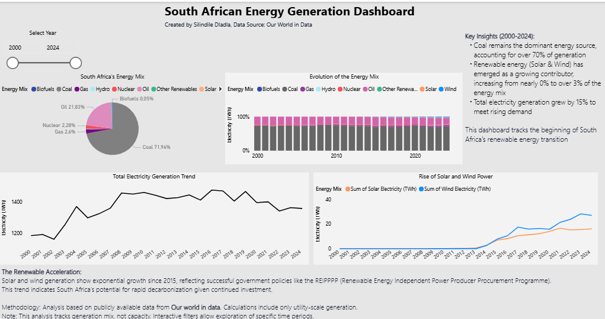

# South African Energy Generation Dashboard



## Project Overview

An interactive Power BI dashboard analyzing South Africa's electricity generation mix and energy transition from 2000-2024. This project demonstrates the complete data analytics pipeline from raw data to actionable insights.

## Key Insights

- **Coal Dominance:** Persistent reliance on coal, declining slightly from 73% to 72% of generation
- **Renewable Growth:** Solar and wind power grew from near 0% to over 3% of the energy mix
- **Demand Increase:** Total electricity generation increased by 15% over the period
- **Transition Pace:** Visualization of the beginning of South Africa's renewable energy transition

## Technologies Used

- **Power BI** - Data visualization and dashboard development
- **Power Query** - Data transformation and cleaning
- **DAX** - Custom measures and calculations
- **Excel** - Initial data exploration

## Project Structure

```
sa-energy-dashboard/
├── data/
│   ├── raw/                    # Original datasets
│   └── processed/              # Cleaned and transformed data
├── documentation/
│   ├── methodology.md          # Analysis approach
│   └── insights.md             # Detailed findings
├── images/
│   └── dashboard-preview.png   # Dashboard screenshot
└── README.md                   # Project documentation
```

## Getting Started

### View the Dashboard
1. Download the `energy-dashboard.pbix` file
2. Open in **Power BI Desktop** (free)
3. Interact with filters and slicers to explore the data

### Recreate the Analysis
1. Access the raw data from [Our World in Data](https://ourworldindata.org/energy)
2. Follow the data cleaning steps in `documentation/methodology.md`
3. Import the processed data into Power BI

## Methodology

### Data Sources
- Primary data: [Our World in Data - Energy](https://ourworldindata.org/energy)
- Time period: 2000-2024
- Geographic scope: South Africa

### Data Processing
1. **Data Collection:** Downloaded CSV datasets from Our World in Data
2. **Data Cleaning:** Handled missing values, standardized formats, resolved data type issues
3. **Transformation:** Created date tables, calculated percentage contributions
4. **Modeling:** Built star schema with proper relationships
5. **Visualization:** Designed interactive reports with intuitive navigation

## Skills Demonstrated

- **Data Cleaning** - Transforming raw, messy data into analysis-ready formats
- **DAX Programming** - Creating measures for dynamic calculations
- **Data Visualization** - Designing intuitive and informative dashboards
- **Business Intelligence** - Translating data into actionable insights
- **Sustainability Analytics** - Applying data analysis to environmental challenges

## Contact

**Silindile Dladla**
- LinkedIn: [linkedin.com/in/silindiledladla](https://www.linkedin.com/in/silindiledladla/)
- Email: nokwandaslindile4@gmail.com

---

